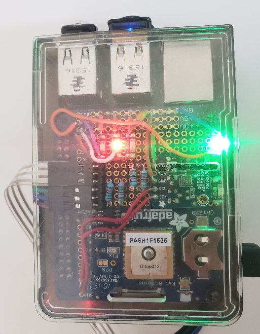

# KITT

KITT is a Raspberry-Pi-based cycling GPS logger based on [Adafruit's Ultimate GPS HAT](https://www.adafruit.com/product/2324)



### Servicing

* _Raspberry Pi_ - If Rasperry Pi 2 fails, replace with a Raspberry Pi 2B **v1.1** only! Raspberry Pi 2B v1.2 and more recent version will not work, as disk image is based on Raspbian Wheezy, which will not work on these models.
 * _SD Card_ - If SD Card needs to be replaced, flash the disk image `kitt_2021-05-03.img` onto a new 8 GB micro SD Card and use directly in Pi. 
 * _KITT Board_ - A replacement Adafruit board is in your electronics box. Use that one to recreate it. 
 * _Battery_ - Connection between battery and USB cable will get finicky after a while from the contant bouncing. This can be noticed in the red power LED in the Rasbperry Pi not being continously lit. After verifying that it is not the USB connection between the cable and the Raspberry Pi, replace the battery with a new one.

### Notes

Contents of `sudo crontab -l` are the following. This ensures that KITT automatically restarts after at most 10 seconds in the case of a crash.
```
@reboot /home/pi/kitt/cron/kitt_autostart
* * * * * /home/pi/kitt/cron/cronhr05
* * * * * /home/pi/kitt/cron/cronhr15
* * * * * /home/pi/kitt/cron/cronhr25
* * * * * /home/pi/kitt/cron/cronhr35
* * * * * /home/pi/kitt/cron/cronhr45
* * * * * /home/pi/kitt/cron/cronhr55
* * * * * /home/pi/kitt/cron/cronkitt00
* * * * * /home/pi/kitt/cron/cronkitt10
* * * * * /home/pi/kitt/cron/cronkitt20
* * * * * /home/pi/kitt/cron/cronkitt30
* * * * * /home/pi/kitt/cron/cronkitt40
* * * * * /home/pi/kitt/cron/cronkitt50
```
